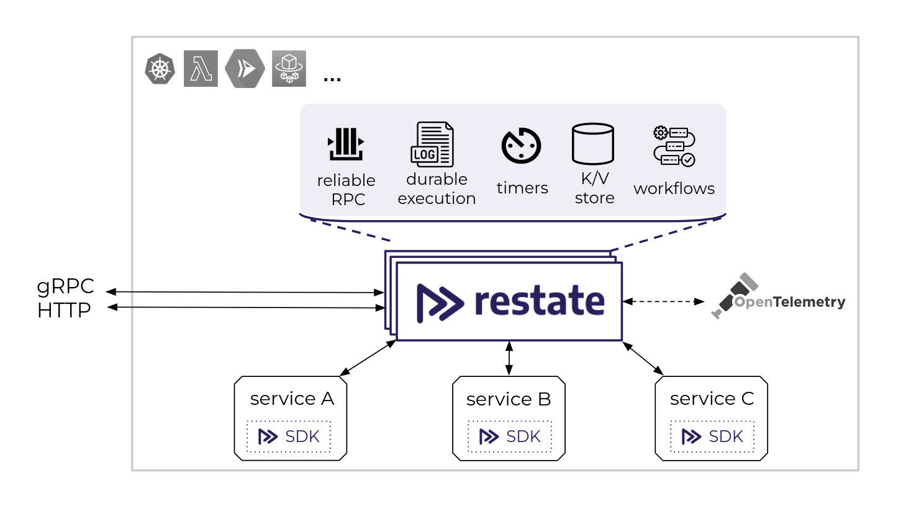

# Welcome to Restate!

Restate is a system for easily building resilient applications using **distributed durable RPC & async/await**.

Have a look at the website to learn more: [https://restate.dev]()

### Restate is currently in private beta:
Send us a request to get access to the code, docs and examples:

<a id="quickstartButton" class="overviewButton btn btn-primary btn-lg px-4 mb-2" href="https://forms.gle/G8kDuucqhBoTfMwLA" role="button">>> Request access</a>

